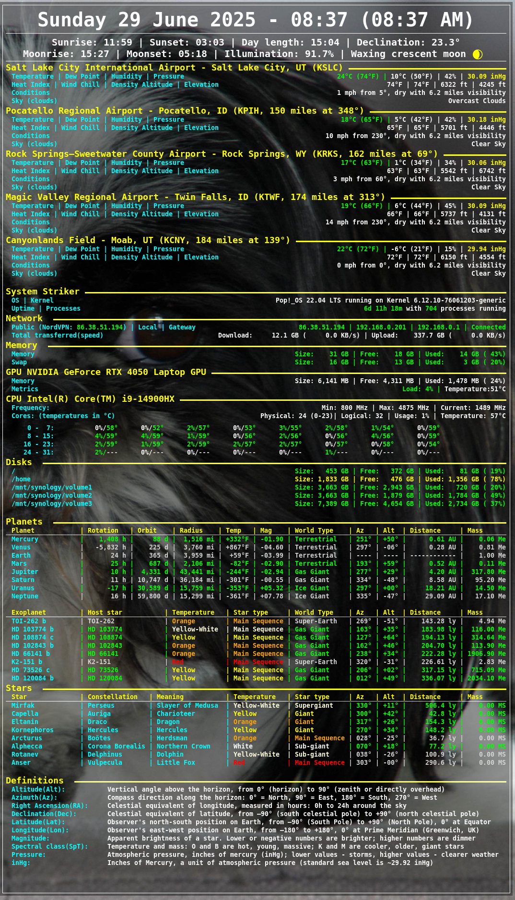

# Real-Time System, Weather and Astronomy Data Display with Conky

This repository provides a Python-based integration designed to display various real-time system and astronomical data using **Conky**, a powerful system monitor for X Windows. By leveraging Python, the project interfaces with Conky to provide dynamic, customizable outputs directly onto the desktop, allowing users to track system performance and celestial information without opening additional applications.

The integration pulls a wide range of data, including but not limited to:

- **System Statistics**: Real-time metrics such as CPU usage, memory consumption, disk space, network bandwidth, GPU temperature, and disk health are continuously monitored and displayed. This ensures users can keep track of their system’s performance with up-to-date information on resource utilization and potential issues.

- **Weather Information**: It fetches weather data for a list of airports, providing current conditions, temperature, wind speed, and other relevant information to help users stay informed about the weather at multiple locations.

- **Astronomical Data**:
  
  - **Solar System Data**: Information on planets within our solar system, including their mass, distance from Earth, azimuth (Az), altitude (Alt), temperature, world type (e.g., terrestrial, gas giant), radius, and rotation/orbit period.
  - **Exoplanet Data**: Details on exoplanets, including host star characteristics (temperature, type), planet mass, orbital characteristics, and more.
  - **Star Data**: Comprehensive star data, including star type (e.g., red giant, white dwarf), constellation, distance from Earth, temperature, and azimuth/altitude coordinates for real-time star tracking.

- **Astronomical Definitions**: It also provides definitions for key astronomical terms like Azimuth (Az), Altitude (Alt), Right Ascension (RA), Declination (Dec), Latitude (Lat), Longitude (Lon), Star Type (SpT), and more, aiding users in understanding the technical terms related to celestial navigation and observation.

By pulling this diverse range of data into Conky, the integration offers a convenient and aesthetically pleasing way to monitor not only your system’s health but also space-related data in real-time, turning your desktop into an interactive space and system monitoring hub.

## Installation

### Prerequisites

Make sure you have the following installed:

- Python 3.x
- Conky (system monitor)
- Git (for cloning the repository)

### Install Conky

If you don’t have Conky installed, you can install it using your system’s package manager. On Ubuntu/Debian-based systems:

```bash
sudo apt-get install conky
```

On other systems, check your distribution's instructions for installing Conky.

### Open weather API:

Open a weather API account, https://openweathermap.org/api, and save the API key

### Clone the Repository

Clone the repository to your local machine:

```bash
git clone https://github.com/wade-rees-me/conky-astro.git
```

Navigate to the project directory:

```bash
cd conky-astro
```

### Install Dependencies

To install the required Python dependencies, run the following command:

```bash
pip install -r requirements.txt
```

### Key Updates:

1. **Environment Variable Setup**:
   
   ```bash
   export KEY_OPEN_WEATHER_API="your_api_key"
   export CONKY_HOME="$HOME/Conky"                                                                                                                                  
   export CONKY_ASTRO_HOME="$HOME/Conky/conky-astro"
   export CONKY_ASTRO_LOGS="$HOME/Logs"
   export CONKY_AIRPORT_CODE = "KSLC"
   export CONKY_PUBLIC_IP = "000.000.000.000"
   export CONKY_LOCAL_IP = "000.000.000.000"
   ```

2. **Crontab Setup**:
   
   ```bash
   mkdir -p $CONKY_ASTRO_LOGS
   ```
   
   ```bash
   10 8 21 * * $CONKY_ASTRO_SCRIPTS/get-astro-data.py >> $CONKY_ASTRO_LOGS/astro-data-$(date +\%F-\%H-\%M-\%S).log 2>&1                                            
   20 8 21 * * $CONKY_ASTRO_SCRIPTS/get-exoplanet-data.py >> $CONKY_ASTRO_LOGS/exoplanet-data-$(date +\%F-\%H-\%M-\%S).log 2>&1                                    
   30 8 21 * * $CONKY_ASTRO_SCRIPTS/get-star-data.py >> $CONKY_ASTRO_LOGS/star-data-$(date +\%F-\%H-\%M-\%S).log 2>&1                
   ```

3. **Conky Configuration**:

Modify your Conky configuration file: conf/astronomy-display.conf. You can modify the Conky configuration to fit your system's needs. You can adjust the time intervals (e.g., `execpi 28800` for fetching data every 8 hours) and paths to the Python scripts according to your setup. Ensure that the environment variables like `CONKY_ASTRO_SCRIPTS` are correctly set.

   ```bash
The `conf/astronomy-display.conf` file in this repository is designed to integrate various system and astronomical data using environment variables for flexibility. Here is an example of how the `conky.text` section of the Conky configuration can be structured:

```lua
conky.text = [[
    #
    # Time
    #
    ${goto 10}${color white}${font8}${alignc}${time %A %d %B %Y} - ${time %H:%M} (${time %I:%M %p})${font}
    ${goto 10}${hr 1}
    ${execpi 28800 ${CONKY_ASTRO_SCRIPTS}/sun.py}
    ${goto 10}${voffset -12}${hr 1}${voffset -6}
    #
    # Weather - rotating
    #
    ${execpi 180 ${CONKY_ASTRO_SCRIPTS}/airports.py}

    #
    # System
    #
    ${execpi 1800 ${CONKY_ASTRO_SCRIPTS}/system.py}
    #
    # Network
    #
    ${execpi 60 ${CONKY_ASTRO_SCRIPTS}/network.py}
    #
    # Memory
    #
    ${execpi 60 ${CONKY_ASTRO_SCRIPTS}/memory.py}
    #
    # GPU
    #
    ${execpi 3 ${CONKY_ASTRO_SCRIPTS}/gpu.py}
    #
    # CPU
    #
    ${execpi 3 ${CONKY_ASTRO_SCRIPTS}/cpu.py}
    #
    # Disks
    #
    ${execpi 60 ${CONKY_ASTRO_SCRIPTS}/disks.py}

    #
    # Planets, Stars and Constellations
    #
    ${execpi 1800 ${CONKY_ASTRO_SCRIPTS}/planets.py}
    ${execpi 60 ${CONKY_ASTRO_SCRIPTS}/exoplanets.py}
    ${execpi 1800 ${CONKY_ASTRO_SCRIPTS}/stars.py}

    ${execpi 28800 ${CONKY_ASTRO_SCRIPTS}/definitions.py}
]];
   ```

### How to Use the Configuration:

- **Time**: Displays the current date, time, and formatted time in both 24-hour and 12-hour formats.
- **Weather**: Rotating data fetched from an airport list (using `airports.py`).
- **System Information**: Displays system statistics, such as CPU, memory, GPU, and disk usage.
- **Astronomical Data**: Displays data for planets, stars, constellations, and exoplanets fetched using the respective Python scripts.
- **Environment Variables**: The configuration uses the `CONKY_ASTRO_SCRIPTS` environment variable to specify the path to the Python scripts.


4. **Prerequisites and Installation**: Instructions for installing dependencies and setting up the environment.
   
Update the data/mountpoints.txt file with your file systems.

   ```bash
/
home
/mnt/synology/volume1
/mnt/synology/volume2
/mnt/synology/volume3
   ```

5. **Airports**:

Update the data/airport-data.json file. Replace KSLC with your home airport and all other airports with distance and direction from your home airport.

```bash
{                                                                                                                                                               
  "KSLC": {                                                                                                                                                     
    "name": "Salt Lake City International Airport",                                                                                                             
    "location": "Salt Lake City, UT",                                                                                                                           
    "latitude": 40.7861,                                                                                                                                        
    "longitude": -111.9822,                                                                                                                                     
    "distance_from_KSLC_miles": 0.0,                                                                                                                            
    "direction_from_KSLC_degrees": 0.0,                                                                                                                         
    "elevation_m": 1294                                                                                                                                         
  }                                        
},                                        
```

## Usage

To run the Python integration with Conky:

```bash
./scripts/get-astro-data.py
./scripts/get-exoplanet-data.py
./scripts/get-star-data.py
scripts/restart.sh
```

This will output real-time data to be displayed in Conky.

## Example Output



## License

This project is licensed under the MIT License. See the [LICENSE](LICENSE) file for more information.

## Acknowledgements

- [Conky](https://github.com/brndnmtthws/conky) - The system monitor tool.
- Python community for creating robust tools and libraries.
- Various contributors and open-source projects that make data integration and visualization easier.

## Contributing

We welcome contributions to this project! To contribute:

1. Fork the repository and create a new branch.
2. Submit a pull request with your proposed changes.

If you find any bugs or issues, feel free to open an issue in the repository.

Feel free to open an issue or pull request if you have any questions or suggestions!
